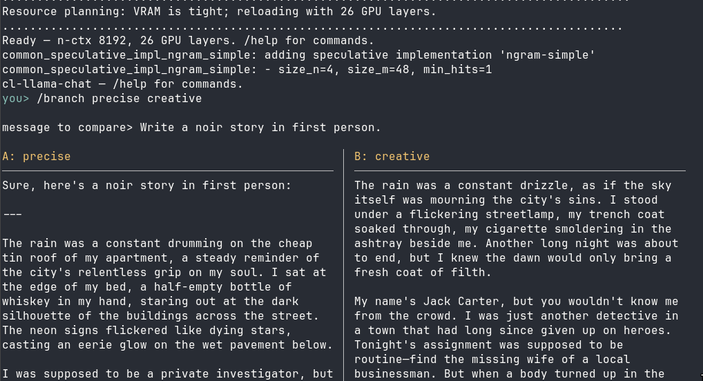

* Cl-Llama-Chat

A small terminal LLM chat application built on [[https://github.com/licjon/cl-llama-cpp][cl-llama-cpp]].

Normal chat is a single scrolling transcript with streamed replies. The standout
feature is *side-by-side branch/sampler comparison*: from any point you spawn two
alternate assistant replies — each optionally using a different sampler preset —
view them side-by-side, then pick a winner to commit and discard the rest. The
alternates are generated cheaply by forking the model's KV cache
(=save-state= / =load-state=) so the prompt is decoded only once; the main
conversation is never disturbed while you explore.

** Installation

Requires SBCL, a working =cl-llama-cpp= (with =libllama.so= built), and a GGUF
model. Place this directory on your ASDF source registry (Roswell users: it is
found automatically under =~/.roswell/local-projects/=).

** Usage

*** Run with Roswell (recommended)

Install a =cl-llama-chat= command onto your =PATH= (=~/.roswell/bin/=):

#+begin_src bash
ros install cl-llama-chat
cl-llama-chat
#+end_src

Or run it directly without installing:

#+begin_src bash
ros -s cl-llama-chat -e '(cl-llama-chat:main)' -q
#+end_src

*** Run with SBCL

#+begin_src bash
sbcl --eval '(asdf:load-system :cl-llama-chat)' --eval '(cl-llama-chat:main)'
#+end_src

On first run a default config is written to
=$XDG_CONFIG_HOME/cl-llama-chat/config.lisp= (fallback =~/.config/cl-llama-chat/config.lisp=).
Edit it to set your model path and tweak sampler presets:

#+begin_src lisp
(:model-path "/path/to/model.gguf"
 :auto-resources t
 :n-ctx 8192 :n-gpu-layers 99 :max-tokens 256
 :system-prompt "You are a helpful assistant."
 :presets (("balanced" :temp 0.7)
           ("creative" :temp 1.4 :top-p 0.95 :min-p 0.05)
           ("wild"     :temp 1.9 :top-p 0.98 :min-p 0.02)
           ("precise"  :temp 0.2))
 :default-sampler "balanced")
#+end_src

*You must supply a model.* The autogenerated config defaults =:model-path= to
=~/models/qwen2.5-14b-instruct-q4_k_m.gguf=. Either:

- download that model (a GGUF quant of Qwen2.5-14B-Instruct) and place it at
  =~/models/qwen2.5-14b-instruct-q4_k_m.gguf=, so the default works as-is; or
- set =:model-path= to the absolute path of any GGUF model you already have.

The app will fail to start if =:model-path= does not point at an existing file.

With =:auto-resources t= (the default), =cl-llama-cpp='s resource planner
(=suggest-configuration=) sizes =:n-ctx= and =:n-gpu-layers= to fit free VRAM at
startup — so on a GPU that can't hold the whole model it offloads as many layers
as fit instead of erroring. =:n-ctx= and =:n-gpu-layers= then act as ceilings.
Set =:auto-resources nil= to use them verbatim.

Note: the planner keeps =:n-ctx= and reduces GPU layers to make it fit. If you
prefer maximum speed over context length, lower =:n-ctx= — that frees VRAM so
more layers stay on the GPU.

llama.cpp / ggml log output (including the =CUDA Graph id N reused= chatter that
would otherwise interleave with streamed tokens) is suppressed; only error-level
messages reach =*error-output*=.

Sampler preset plists accept any keyword =cl-llama-cpp:make-sampler-config=
supports (=:temp=, =:top-k=, =:top-p=, =:min-p=, =:mirostat=, =:xtc-probability=,
=:repeat-penalty=, …).

*** Commands

| Command            | Effect                                           |
|--------------------+--------------------------------------------------|
| (plain text)       | Send a normal chat turn                          |
| =/branch [A] [B]=  | Compare two replies to your next message         |
| =/regen=           | Re-roll the last assistant reply                 |
| =/sampler NAME=    | Change the persistent default sampler preset     |
| =/presets=         | List the configured sampler presets              |
| =/bench=           | Benchmark speculative decoding                   |
| =/reset=           | Clear the conversation (keeps the system prompt) |
| =/help=            | Show the command list                            |
| =/quit= / =/exit=  | Exit                                             |

=/branch= with no preset names uses the current default for both candidates
(useful for pure same-sampler branching); give one or two preset names to
compare different samplers. A chosen branch's sampler applies to that response
only — it does not change the default. Use =/sampler= to change the default
going forward.

=/regen= re-rolls the *last* assistant reply: it drops that reply, keeps your
message, and samples a new answer for it with the current default sampler and a
fresh seed. (=/branch= compares two candidates for a *new* message you type;
=/regen= replaces the answer you just got.)

